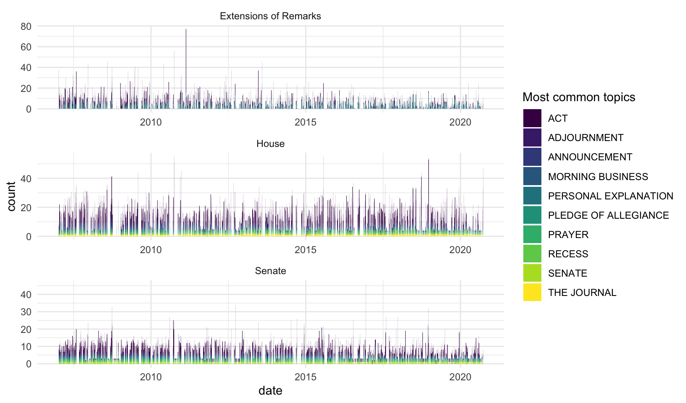
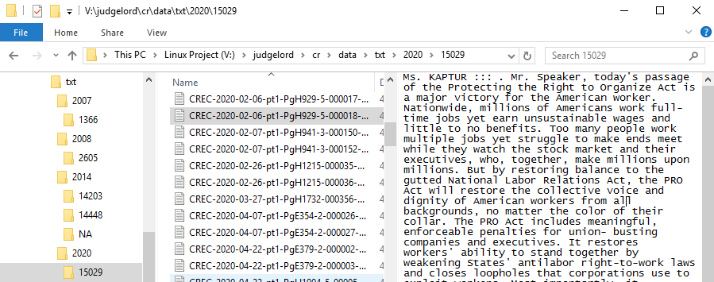
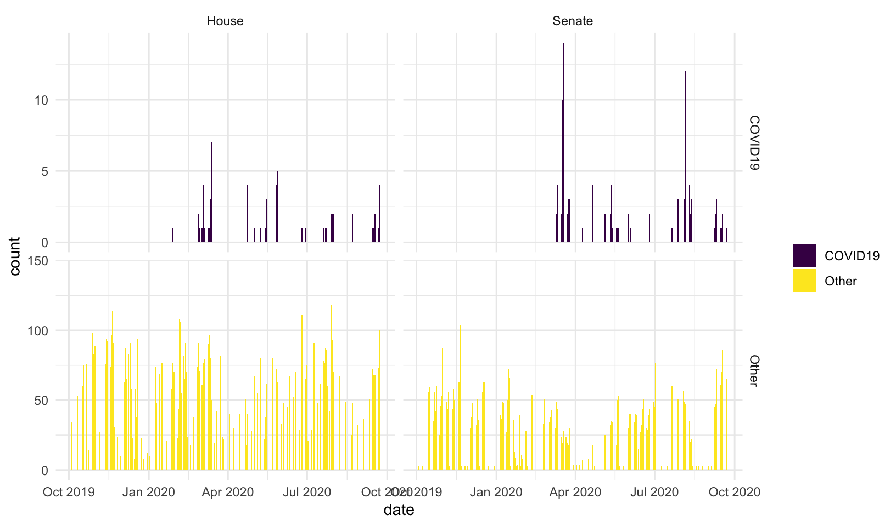

## Scrape, parse, and analyze the Congressional Record 

This repo contains functions to do three things:

### 1. Scrape the text of the congressional record and metadata from congress.gov

- `scraper.R` contains functions to scrape sections of the record and save them as htm files in a directory. `get_cr_df()` first scrapes metadata for all subsections for each day of the record, including headers and links to the raw text. `get_cr_htm()` then downloads the raw text of each subsection as a .htm file to a "data/htm" directory. 
- scraper methods are described [here](https://judgelord.github.io/cr/scraper.html)

### 2. Parse the record into .txt files by speaker

- `parser.R` contains functions to parse htm sections of the record by speaker and tag members with their ICPSR ID numbers. By default, `parse_cr()` will parse all htm files in the "data/htm" directory for dates that do not already appear in a "data/txt" directory. You may specify a custom vector of `dates` or `skip_parsed = FALSE` if you don't want to skipped files already parsed.
- the parser methods are explained [here](https://judgelord.github.io/cr/speakers)
- `count_speeches.R` contains methods to count speeches per member
- summary tables and figures of speech counts are [here](https://judgelord.github.io/cr/summary.html)
- the parsed .txt directory looks like this:

### 3. Count and extract sentences that contain user-specified phrases

- Preliminary work on feature extraction is [here](https://judgelord.github.io/cr/features)  
- There is also a brief tutorial on feature extraction at the end of the scraper docs [here](https://judgelord.github.io/cr/scraper.html#Text_features)

### Other notes 

Hein-bound data   

- Before deciding to scrape and parse the record from scratch, I tried to use existing speech data from Hein bound. Unfortunately, these data are incomplete and have a few errors. Most notably, they do not retain the date of the speech. My notes on these data and code to merge them with voteview data [here](https://judgelord.github.io/cr/member_data). A few plots comparing Hein-bound speech counts to NOMINATE scores and vote share are [here](https://judgelord.github.io/cr/speeches)